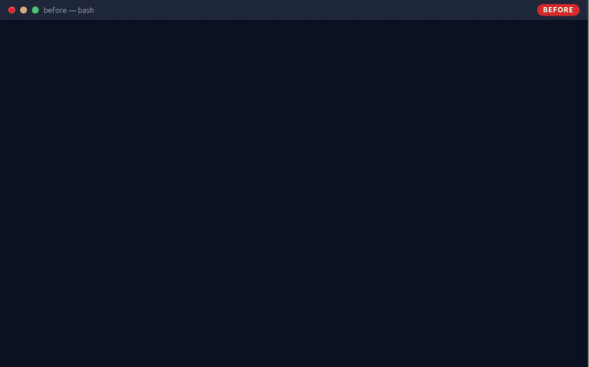

# Lovable app → production: a before/after rescue case



A small team task tracker ("TaskFlow") built the way AI app builders build them — Vite + React + TypeScript + Supabase JS, Lovable-style — in two states:

- [`before/`](before/) — as handed over: build fails, login loops, routes unprotected, white screens, secrets in git.
- [`after/`](after/) — the same app after a 48-hour production pass: builds, tested, deploy-ready, honest about what it can't do.

> **About this case.** It is a reconstructed demo, not a client project: the `before/` app was written to contain the failures I see most often in AI-generated handovers, and every one of them is reproducible locally (see [How to reproduce](#how-to-reproduce)). Supabase keys in the repo are fake placeholders; the fixed app runs in a `localStorage` demo mode when no Supabase project is configured.

| | `before/` | `after/` |
|---|---|---|
| `npm run build` | fails — 4 TypeScript errors | passes |
| Tests / CI | none | 5 Vitest tests + GitHub Actions |
| Secrets | hardcoded + `.env` (service-role key) in git | `VITE_*` env vars, `.env.example`, `.env` ignored |
| Auth | login loop, `/tasks/:id` open to anyone | session-aware guard, redirect back after login |
| Errors | white screen | error boundary + inline messages with Retry |
| Data | every task + one query per author (N+1) | one paginated query, 10 per page |
| Deploy | 404 on refresh of deep links | `vercel.json` + `netlify.toml` rewrites |

## Situation — the ticket

> Hi — I built a small team task tracker in Lovable (React + Supabase). It works in the Lovable preview, but I connected the GitHub repo to Vercel and now: (1) the Vercel build fails — `Command "npm run build" exited with 2`, something about TypeScript; (2) when I deploy it anyway, **login loops** — I sign in and land back on the login page, and after a refresh I'm logged out again; (3) opening a task link directly (e.g. `/tasks/42`) gives a **404** on Vercel, and sometimes just a **blank white page**; (4) the "Summarize with AI" button spins forever. Can you make this production-ready? I want it on Vercel with my own domain. Fixed price please.

## What was broken — symptom → root cause → fix

| # | Symptom | Root cause | Fix |
|---|---|---|---|
| 1 | `npm run build` fails on Vercel | `tsc` runs before `vite build`; an unused import plus `setTasks(data)` where `data` is `any[] \| null` — the dev server never type-checks, so it "worked" in preview | Typed `Backend` interface: queries return data or throw; dead import removed; build + tests in CI |
| 2 | Login loop; logged out after refresh | `RequireAuth` redirects whenever `session` is `null`, but the session loads asynchronously → the first render always redirects. The login form ignores `{ error }` and navigates anyway. Google sign-in `redirectTo` points at the Lovable preview domain | `AuthProvider` exposes `loading`; the guard waits, then redirects and remembers `from`; sign-in errors are shown; `redirectTo: window.location.origin`; Site URL / Redirect URLs checklist |
| 3 | `/tasks/:id` opens without signing in | Route added later and never wrapped in the guard | One protected layout route; new pages inherit protection |
| 4 | Blank white page | Failed request → supabase-js returns `data: null` → `setComments(null)` → `null.map()` throws during render; no error boundary | Errors surface as `BackendError` → inline message + Retry; root `ErrorBoundary` |
| 5 | 404 on refresh of any deep link | Static host has no file for `/tasks/42` and no SPA rewrite rule | `vercel.json` rewrites + `netlify.toml`; `scripts/serve-static.mjs` reproduces both behaviours locally |
| 6 | Secrets in git | URL + anon key hardcoded in `src/integrations/supabase/client.ts`; `.env` with the **service-role** key committed — the Vite template's `.gitignore` doesn't list `.env` | Config from `VITE_SUPABASE_URL` / `VITE_SUPABASE_ANON_KEY`; `.env.example`; `.env` ignored; key rotation in the handover |
| 7 | Edge function URL is `undefined/functions/v1/…` | `.env` variables have no `VITE_` prefix, so `import.meta.env.SUPABASE_URL` is `undefined` in the browser | `resolveConfig()` reads `VITE_*` (unit-tested) and falls back to demo mode |
| 8 | "Summarize with AI" spins forever | Raw `fetch` with no `res.ok` / network / CORS handling; the Edge Function sends no CORS headers and no OPTIONS response | `functions.invoke` with error handling; function returns CORS headers, JSON errors, checks auth and input |
| 9 | Task list slow as the team grows | Loads every row, then one query per task for the author's name (N+1), no pagination | One query with a join (`select('*, author:profiles(full_name)')` + `range`), 10 per page with a total count |

## What I did (the 48-hour pass)

**Day 1 — reproduce, stabilise.** Clone, `npm run build`, open the app: write down every symptom with the exact error. Fix the build (types, not `as any`). Move config to env vars, add `.env.example`, ignore `.env`, flag the leaked service-role key for rotation. Rewrite the auth flow (provider with loading state, guard, redirect-back, visible errors) and put every app route behind one protected layout. Add the error boundary and inline error states.

**Day 2 — harden, ship.** Replace the N+1 loop with one paginated query. Fix the Edge Function (CORS, preflight, JSON errors) and the client call. Add `vercel.json` / `netlify.toml`, tests for config and the data layer, and CI. Write the handover: [`after/README.md`](after/README.md) with the deploy checklist (env vars, Supabase Site URL + Redirect URLs, domain) and this before/after table.

## Result

- `after/`: `npm run build` passes, `npm test` — 5/5, CI green on push (build + tests; a second job asserts that `before/` still fails, so the case stays honest).
- Secrets out of the repo; config documented; deploy-ready for Vercel/Netlify with SPA rewrites.
- Auth, protected routes, error handling, pagination — all in place and visible in the GIF.
- Known limits, stated up front: the Supabase adapter is written and type-checked but not run against a live project here (no project in this public repo); demo mode stores data in `localStorage`; the AI summary in demo mode is a canned sentence; no live Vercel URL — the 404/200 behaviour is shown with a tiny local static server that mimics a host with and without rewrite rules.

## Demo

- [`demo.gif`](demo.gif) — before (≈9 s) then after (≈11 s); [`before.gif`](before.gif), [`after.gif`](after.gif) separately.
- Recorded with `scripts/record-demo.mjs` (Playwright video → ffmpeg). The terminal frames replay the real output of `npm run build` / `npm test` captured at recording time; the address bar and captions are overlaid because headless recordings have no browser chrome.

## How to reproduce

```bash
# before: build fails, login bounces, /tasks/42 opens without login then white-screens
cd before && npm install
npm run build            # exit code 2, 4 TS errors
npm run dev              # http://localhost:8080 → try to sign in; open /tasks/42 directly
git ls-files .env        # the committed .env (fake values)

# before: 404 on refresh — build without type-check (what "force deploy" does) and serve like a plain host
npx vite build && node ../scripts/serve-static.mjs dist 4174   # http://localhost:4174/tasks/42 → 404

# after: build + tests pass, app runs in demo mode, deep links survive a refresh
cd ../after && npm install
npm run build && npm test
npm run dev              # http://localhost:8080 (demo mode banner)
node ../scripts/serve-static.mjs dist 4173                    # http://localhost:4173/tasks/t7 → 200 (vercel.json rewrite)

# regenerate GIFs / Fiverr images (needs playwright + chromium, and a full ffmpeg — e.g. `npm i -g ffmpeg-static`)
FFMPEG=$(node -p "require('ffmpeg-static')") NODE_PATH=$(npm root -g) node scripts/record-demo.mjs
NODE_PATH=$(npm root -g) node scripts/render-fiverr.mjs
```

## Repo layout

```
before/     the app as handed over (Vite + React + TS + supabase-js 2.49, fake keys, committed .env)
after/      the fixed app: backend adapter (demo mode / Supabase), tests, vercel.json, netlify.toml, schema, edge function
scripts/    serve-static.mjs (host simulator), record-demo.mjs (GIFs), render-fiverr.mjs (portfolio images)
fiverr/     two 1280×769 portfolio images + their HTML templates
.github/    CI: after/ must build and pass tests; before/ must still fail to build
```

## Want this for your app?

Send the repo (or a Lovable / Bolt / v0 / Replit share link) and the symptoms in a sentence or two. You get a written plan and a fixed price within a day; small fixes ship in 24–72 h, everything in writing with a short screen recording — no calls needed.

Built by Oleg Naryzhnykh — [Upwork](https://www.upwork.com/freelancers/~01c66d93b36ab6342b) · [Fiverr](https://www.fiverr.com/sellerdesk).

License: MIT.
